<h1>Project Shoe</h1>
        <h2>realizzato da Cristaudo Giuseppe 0001002904 per CG2122_MOD1</h2>
        
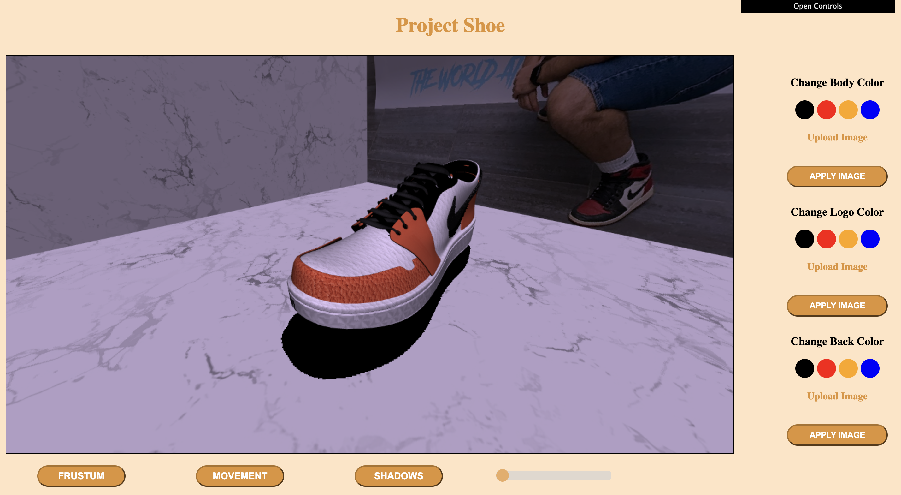

        
Introduzione

        

            L'idea di <b>Project Shoe</b> nasce da una passione verso il mondo delle sneakers 
            in edizione limitata. Tramite l'applicazione web sarà infatti possibile visualizzare un modello di una
            <b>Nike Jordan 1 Low</b> ed esplorare le componenti principali che la costituiscono. Inoltre, Project Shoe permette di apprezzare 
            la scarpa nelle sue corolazioni più iconiche e di personalizzarla dando sfogo alla propria
            creatività!
        

        
Box

        

            La sneaker proposta è stata inserita all'interno di un contesto che potesse valorizzarla al meglio. 
            A tal proposito, è stato creato una sorta di <b>box</b> che la contenesse e che ne esaltasse i dettagli. 
            La scatola è stata dunque realizzata a partire da 3 piani di uguale dimensione, ruotati lungo l'asse X e Z
            e traslati adeguatamente per formare le pareti e il pavimento. Ai paini sono state poi applicate due diverse texture:
            una texture marmorea per dare un senso di maggiore lusso alla scarpa e una texture raffigurante me 
            (come espresso da requisiti) nel mio stand di sneakers in una delle convetion del settore più importanti d'Italia. 
            Entrambe le texture, come anche quelle descritte successivamente, sono state modellate in modo da avere una dimensione di 1024x1024px
            garentendo un buon compromesso tra qualità e pesantezza della texture.
        

        

            <table style="border: 0;" cellpadding ="10%">
                <tr>
                    <td>
                        
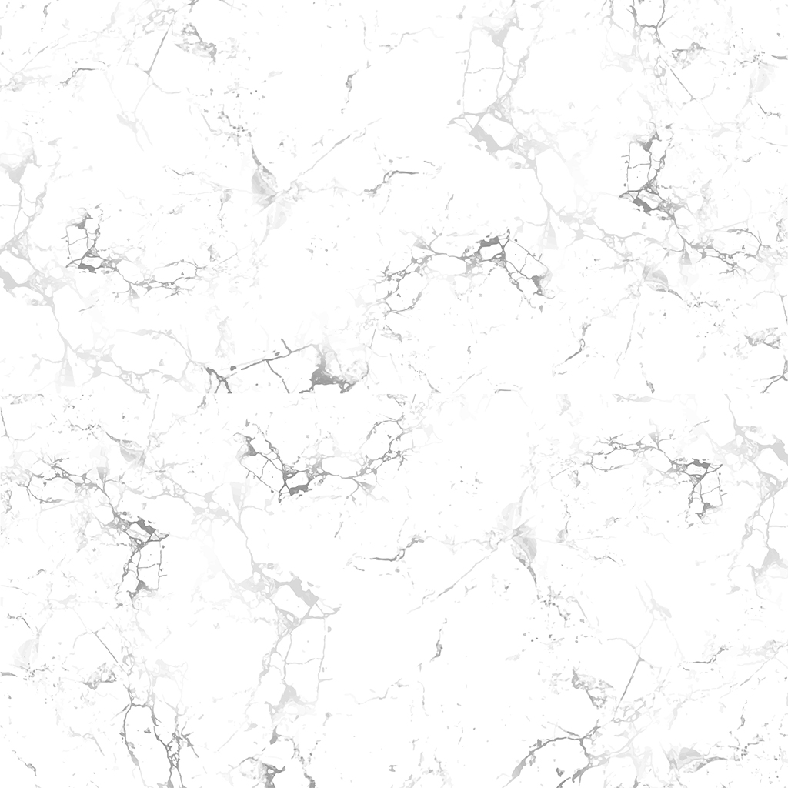

                    </td>
                    <td>
                        
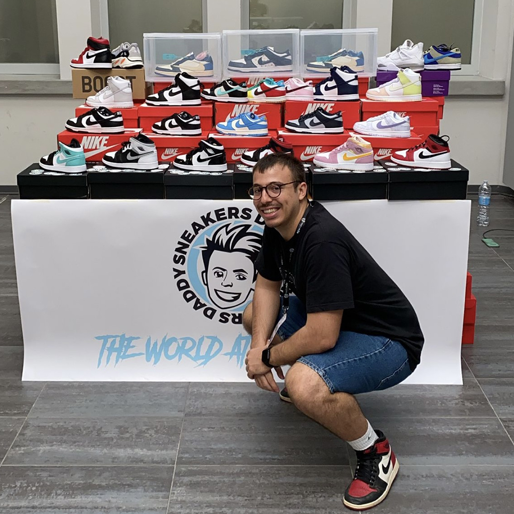

                    </td>
                </tr>
            </table>
        

        
Sneaker

        

            La geometria della sneaker è stata realizzata con Blender, il quale ha permesso di esportare le componenti che la costituiscono
            singolarmente in formato <b>.obj</b>. La nacessità di esportare le singole componenti è nata dalle limitazioni del formato utilizzato
            che si scontrano con il risultato voluto (spiegato nel paragrafo delle <a href="#interazioni">interazioni</a>) dove è possibile esaminare
            l'anatomia della scarpa. 
            Infatti il formato .obj utilizzato per caricare la geometria della sneaker non supporta nativamente tecniche di skinning o di animazioni e 
            per questo motivo è stato necessario scomporre l'oggetto elaborato in componenti autonome. 
            Inizialmente, ogni componente veniva caricata con la definizione del materiale generata da Blender, tuttavia 
            non essendo completamente soddisfatto del risultato ottenuto (disponibile <a href="./shoes-with-mtl/index.html" target="_blank">qui</a>), ho optato per applicare ad ogni oggetto esclusivamente una texture predefinita.
            In questo modo, nonostante la mancanza di definizione del materiale, le texture di alta qualità hanno garantito un buon risultato finale.  
            Le texture utilizzate sono le seguenti:
        

        

            

            <table style="border: 0;" cellpadding ="10%">
                <tr>
                    <td>
                        

                            
                             
                            <b>Black Leather</b>
                        

                    </td>
                    <td>
                        

                            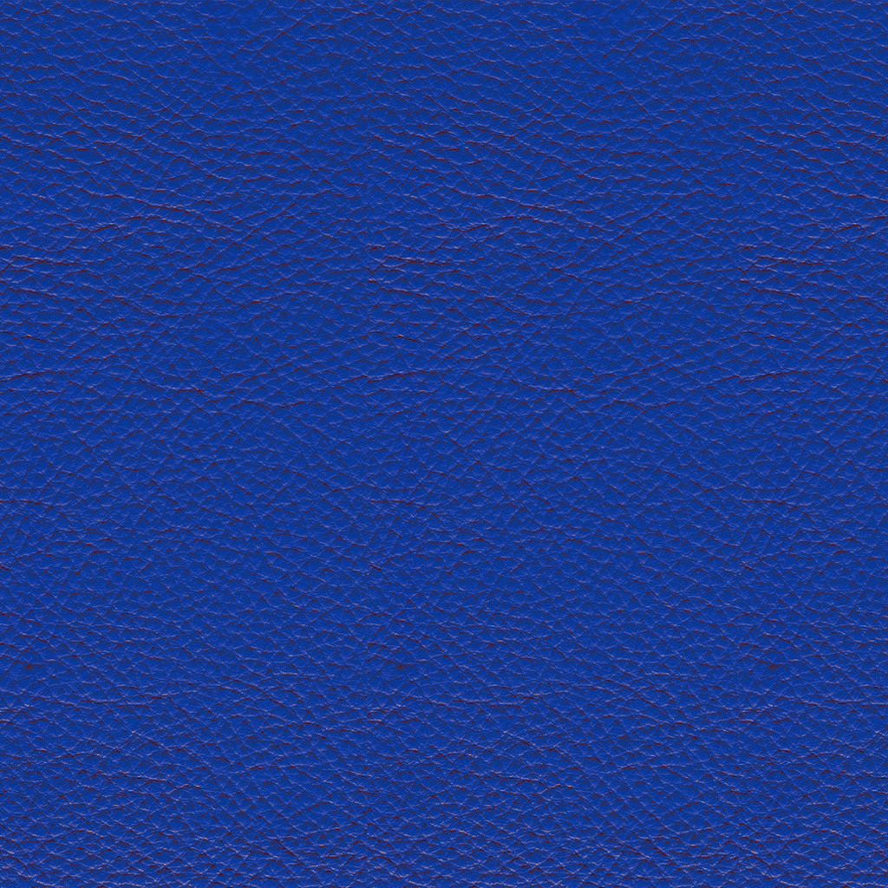
                             
                            <b>Blue Leather</b>
                        

                    </td>
                    <td>
                        

                            
                             
                            <b>Laces Mesh</b>
                        

                    </td>
                    <td>
                        

                            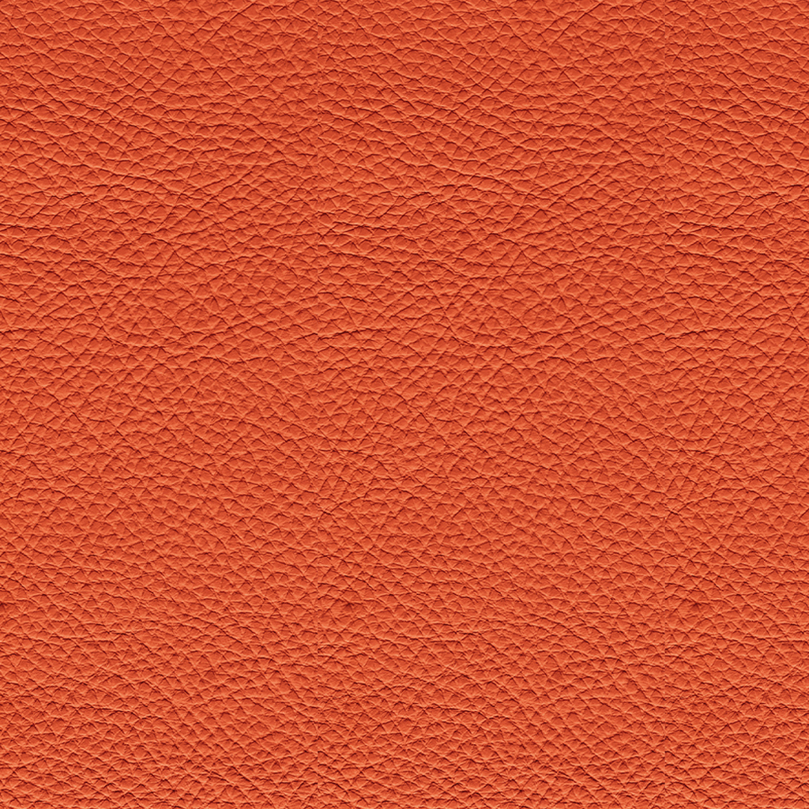
                             
                            <b>Orange Leather</b>
                        

                    </td>
                </tr>
                <tr>
                    <td>
                        

                            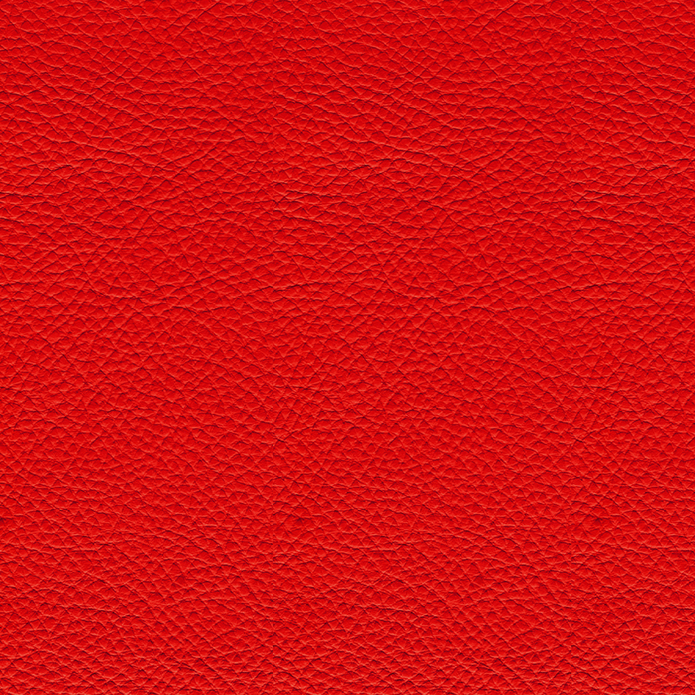
                             
                            <b>Red Leather</b>
                        

                    </td>
                    <td>
                        

                            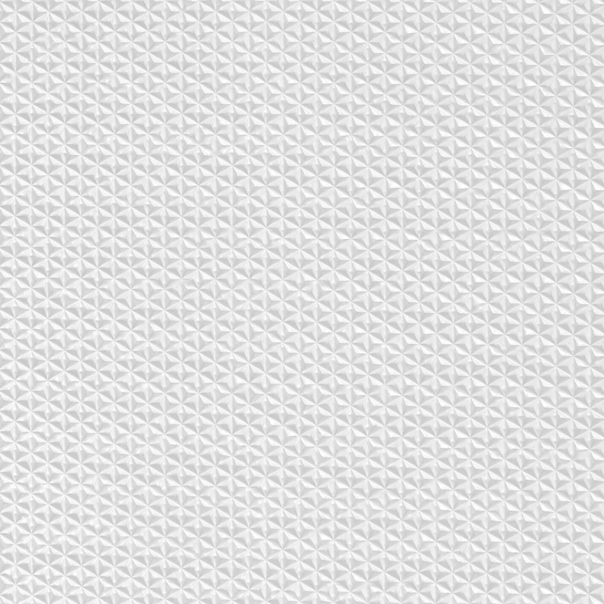
                             
                            <b>Sole Rubber</b>
                        

                    </td>
                    <td>
                        

                            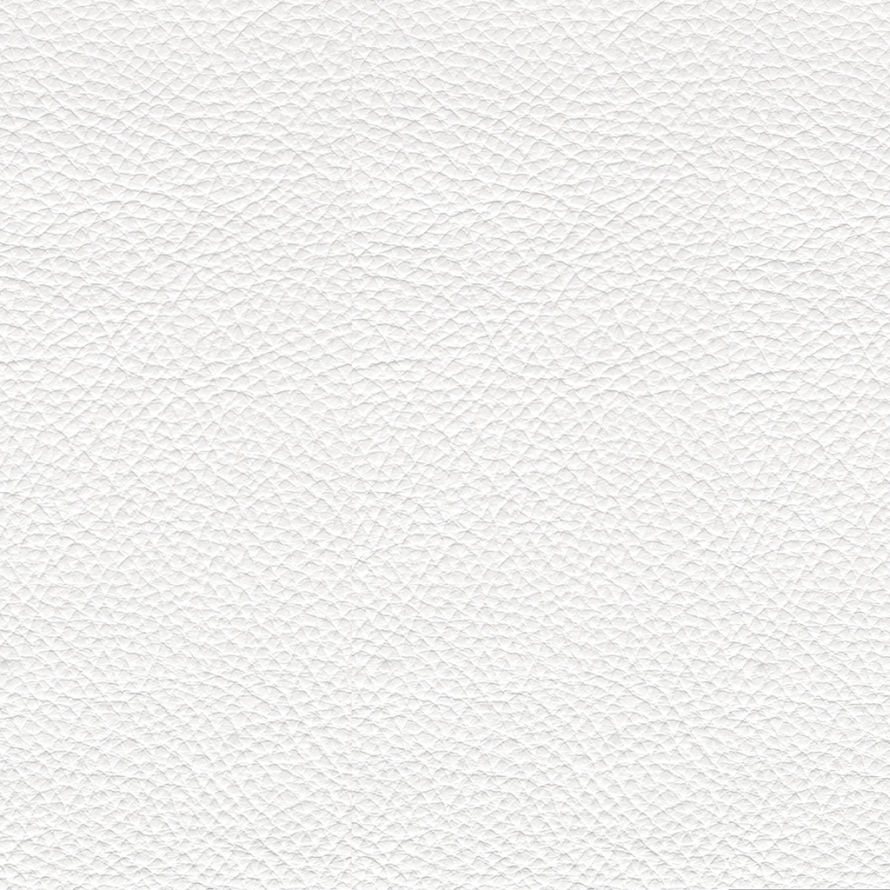
                             
                            <b>White Leather</b>
                        

                    </td>
                </tr>
            </table>
            

        

        
Ombre

        

            Per illuminare la scena è stata posta una luce in sommità della "scatola" precedentemente descritta in modo da simulare il 
            faro da scena tipicamente utilizzato per esaltare i dettagli delle sneakers. La luce è di tipo direzionale così da colpire
            l'oggetto di scena in maniera parallela con tutti i suoi "raggi". Inoltre, tramite l'utilizzo di una depth texture
            che utilizza coordinate di profondità è stato possibile definire le ombre delle componenti. Tuttavia, la necessità di importare le singole 
            componenti e non l'intera scarpa ha influito sulla resa reale della scena. Infatti, come è possibile notare nella zona vicino al 
            logo o al di sotto dei lacci (side mesh), sono visibili zone d'ombre non coerenti con una scena reale. Questo avviene perchè il logo risulta leggermente
            staccato rispetto al corpo e questo induce inevitabilmente a calcolare una profondità maggiore del corpo nonostante, nella realtà, le due componenti 
            siano attaccate. 
            Infine, per aumentare
            la qualità delle ombre è stato utilizzato un bias per ridurre per quanto possibile l'effetto "shadow acne", tuttavia le ombre rimangono 
            pixelate. Tale risultato potrebbe essere risolto tramite l'utilizzo di algoritmi di shading ad hoc con maggiore resa grafica.
        

        
Interazioni

        

            Trattandosi di un'applicazione legata alla personalizzazione utente, l'interazione con esso gioca un ruolo fondamentale. 
            Come si può notare dalla schermata principale sono disponibili tre pannelli di controllo:
            <table>
                <tr>
                    <td width="20%">
                        
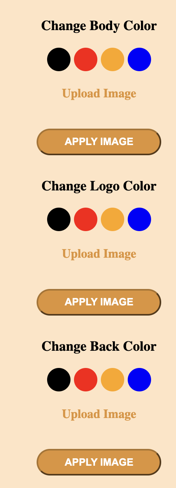

                    </td>
                    <td>
                        Il primo pannello prevede una serie di pulsanti che permettono la personalizzazione della sneaker andando a personalizzarne
                        il colore del retro, del logo e della parte frontale. Come è facilmente intuibile, ad ogni bottone colorato
                        corrisponde una texture del medesimo colore definite in precedenza. In aggiunta a queste funzionalità, cliccando su "Upload Image" sarà possibile, per 
                        ogni componente della scarpa, andare a caricare un immagine dal proprio dispositivo e applicarla sulla zona desiderata cliccando sul pulsante "APPLY IMAGE".
                    </td>
                </tr>
            </table>
            

            <table>
                <tr>
                    <td>
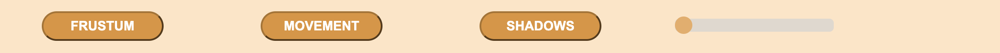
</td>
                </tr>
                <tr>
                    <td>
                        Al di sotto del canvas troviamo tre pulsanti che permettono rispettivamente 
                        di abilitare/disabilitare il frustum della luce direzionale, di abilitare/disabilitare un movimento continuo sull'asse Y della scarpa 
                        e infine di abilitare/disabilitare le ombre. Quest'ultimo è reso possibile semplicemente rimuovendo la parte di calcolo della depth texture,
                        mentre il movimento della scarpa è stato introdotto al fine di dare un maggior senso di interattività all'utente finale.  
                        Infine, troviamo uno slider il cui movimento permette di "esplodere" la sneaker nelle sue singole componenti.
                          
                        
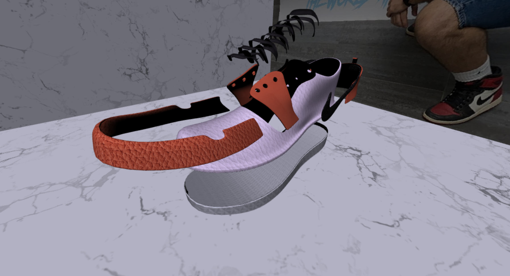

                          
                        Come spiegato nelle istruzioni sotto il canvas, le funzionalità offerte dai bottoni e dallo slider sono ottenibli anche da tastiera. Infatti con <b>f</b> è possibile abilitare/disabilitare il frustum, con <b>s</b> è possibile abilitare/disabilitare le ombre,
                        con <b>m</b> è possibile abilitare/disabilitare il movimento della scarpa e con <b>e</b> è possibile far esplodere e ricomporre la scarpa.
                    </td>
                </tr>
            </table>
            

            <table>
                <tr>
                    <td width="20%">
                        
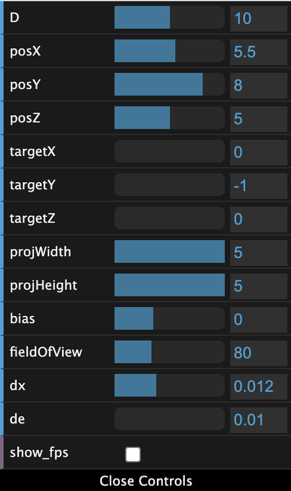

                    </td>
                    <td>
                        Il terzo pannello è stato realizzato tramite dat.gui ed è presente nella parte in alto a destra della pagina web.  
                        Tramite esso è possibile modificare, ad esempio, i parametri legati alla posizione e al target della luce direzionale oppure lagati 
                        alla vista. Inoltre, il parametro <b>dx</b> modifica la velocità di movimento della scarpa lungo l'asse Y, <b>de</b> modifica la velocità con cui la scarpa si 
                        scompone/ricompone e <b>show_fps</b> permette di visualizzare gli fps nel documento html in alto a sinistra. Quest'ultima
                        funzionalità è stata introdotta perchè talvolta il rendering risultava lento ed ero interessato a verificare il numero di fps.
                    </td>
                </tr>
            </table>
            Inizialmente l'applicazione prevedeva anche una rotazione intorno ad un punto fisso della scarpa
            tramite una traslazione, una ruotazione e nuovamente una traslazione opposta alla prima ma il risultato non era appagante e distoglieva 
            l'attenzione sulla possibilità di suddivedere la scarpa nelle sue componenti.
        

        
Mobile

        

            La compatibilità per dispositivi mobile è stata mantenuta garantendo una adattamento delle dimensioni 
            sia del canvas che del pannello di contollo in base alle dimensioni dello schermo del dispositivo. Infine,
            gli eventi del mause che prima venivano catturati dal canvas sono stati adattati anche per eventi touch provenienti da uno schermo touchscreen.
        
